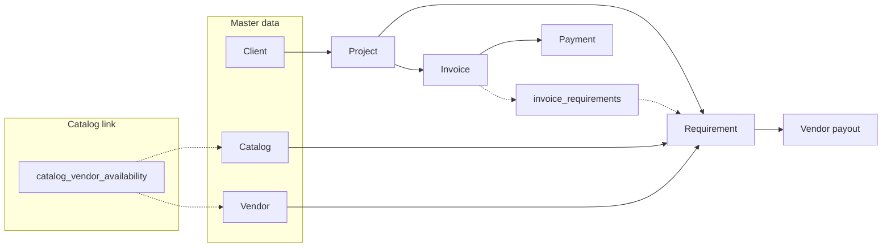

# Flow and Data Gaps – Analysis and Suggestions

## 1. Current architecture (brief)

- **Projects** have `engagement_type` (one_time | monthly); **requirements** link to project + catalog + optional vendor + pricing (and T&M fields).
- **Invoices** link only to project (type: project | milestone | monthly); line items are derived at print from fulfilled requirements. **invoice_requirements** snapshots which requirements an invoice “covers” when it is issued.
- **catalog_vendor_availability** exists (catalog item ↔ vendors who can supply it) but is only used on the catalog detail panel to manage “Vendors who can provide this”; it is **not** used when creating/editing a requirement.

---

## 2. Data and linkage gaps

### 2.1 Invoice ↔ billing period (monthly)

- **Gap:** Invoices have no `billing_period` or `billing_month`. For monthly retainers you create multiple invoices per project (one per month), but there is no structured way to store “this invoice is for March 2025.”
- **Impact:** Reporting (e.g. “invoices for month X”), display (“Invoice for March 2025”), and avoiding duplicate monthly invoices for the same period are all harder.
- **Suggestion:** Add optional `billing_month` (e.g. `DATE` first-of-month or `TEXT 'YYYY-MM'`) to `invoices`. Use it for type = monthly; leave null for project/milestone. Consider a unique constraint per project + billing_month when type = monthly to prevent double-billing the same month.

### 2.2 “Suggest from fulfilled” and monthly

- **Gap:** [getSuggestedInvoiceAmount](src/app/(dashboard)/finance/actions.ts) excludes requirements that appear in **any** issued/paid invoice for the project, including **monthly** invoices. So after the first monthly invoice is issued, the next “Suggest” for that project returns 0.
- **Impact:** For monthly retainers you want to suggest the same amount every month (sum of fulfilled retainer requirements). Current behaviour blocks that.
- **Suggestion:** Exclude from “suggest” only requirements that are on **project** or **milestone** invoices (i.e. one-time billing). For **monthly** invoices, always suggest the sum of fulfilled requirements’ `client_price` (or define a single “retainer set” and sum that). Implementation: in `getSuggestedInvoiceAmount`, when building `invoicedIds`, consider only invoices where `type IN ('project', 'milestone')`, not `monthly`. Optionally, make suggest depend on the **invoice type** the user has selected (e.g. if type is monthly, don’t exclude by invoice_requirements; if project/milestone, do).

### 2.3 Catalog ↔ vendor at requirement creation

- **Gap:** [catalog_vendor_availability](supabase/migrations/20250210000000_goods_services_consulting.sql) links catalog items to vendors. When adding a requirement, [vendorOptions](src/app/(dashboard)/requirements/page.tsx) is “all vendors”; the requirement form does not restrict the vendor dropdown to vendors linked to the selected catalog item.
- **Impact:** Users can assign any vendor to any requirement, even if that vendor is not marked as able to supply that catalog item; the linkage is underused and data quality suffers.
- **Suggestion:** When a catalog item is selected on the new requirement form (and when editing, from the requirement’s catalog item), load vendors from `catalog_vendor_availability` for that `service_catalog_id` and use that list for the vendor dropdown (with an option like “Other / Not listed” if you want to allow ad-hoc assignment). If no vendors are linked, show all vendors with a hint (“Link vendors to this catalog item in Catalog for a filtered list”).

### 2.4 Invoice ↔ requirement linkage semantics

- **Current:** `invoice_requirements` is populated when an invoice is **issued** with all **fulfilled** requirements for that project at that time. So for one-time (project/milestone) it correctly marks “these requirements are on this invoice.” For monthly, the same snapshot happens, which causes the suggest bug above and also implies “this monthly invoice covers these requirements” (which is correct for line-item display but wrong for “don’t suggest again”).
- **Suggestion:** Treat `invoice_requirements` as “requirements consumed by this invoice for **one-time** billing.” Options: (a) Only insert into `invoice_requirements` when the invoice type is project or milestone; or (b) Keep inserting for all types but change `getSuggestedInvoiceAmount` to exclude only requirements that appear on project/milestone invoices. (b) is simpler and keeps a full audit of what each invoice “covers.”

### 2.5 Ledger and invoice type

- Ledger entries store `type` (e.g. client_invoice, client_payment) and amount; they do not store invoice type (project/milestone/monthly). For reporting (“monthly revenue vs one-time revenue”) you’d need to join back to invoices. No schema change strictly required, but worth noting for reporting.

---

## 3. Monthly project flow – specific gaps

| Aspect                        | Current                               | Gap                                      | Suggestion                                                    |
| ----------------------------- | ------------------------------------- | ---------------------------------------- | ------------------------------------------------------------- |
| **Billing period**            | None                                  | Can’t say “invoice for March 2025”       | Add `billing_month` (or similar) for monthly invoices         |
| **Suggest amount**            | Excludes all invoiced requirements    | After first monthly invoice, suggest = 0 | Exclude only project/milestone from suggest                   |
| **Line items**                | All fulfilled requirements every time | Correct for “same retainer every month”  | No change needed                                              |
| **Duplicate monthly invoice** | No guard                              | User can create two “March” invoices     | Optional: unique (project_id, billing_month) for type=monthly |

---

## 4. Workflow section – use case and value

### What it does today

- [flows/page.tsx](src/app/(dashboard)/flows/page.tsx) shows two parallel pipelines: **Monthly / Recurring** and **One-time project**, each with steps 1–8 (Client → Vendors & catalog → Catalog items → Project → Requirements → Invoice → Payment → Vendor settlement).
- “Done” is based on **global** counts (e.g. “at least one client”, “at least one vendor”, “at least one issued/paid invoice”), not per project or per client.
- It’s effectively an **onboarding / setup checklist** (“Have you created a client? Vendors? Catalog? A project? Requirements? An invoice?”) with two variants by engagement type.

### Why it’s confusing

1. **Not project- or client-specific:** You can’t see “where is **this** project in the workflow?” or “what’s left for Client X?”
2. **Same steps, different labels:** Both columns share almost the same steps; the main difference is project type and invoice type. The value of “choose your engagement type” is unclear if the rest of the app already branches on engagement_type.
3. **No clear outcome:** It doesn’t drive a single outcome (e.g. “get this project to invoiced”) or show bottlenecks.
4. **Redundant with rest of app:** Requirements, Finance, Projects already guide the same flow; the page doesn’t add a clear workflow engine (e.g. assignees, due dates, reminders).

### Possible directions

- **A) Onboarding only:** Rename/label as “Setup checklist” or “First-time setup.” Make it explicit: “Complete these once to start using the app.” Remove or simplify the two-column split (e.g. one list with “For monthly: … / For one-time: …” as subtext).
- **B) Project-centric workflow:** Change to “Workflow for **this project**” (e.g. from project detail). Steps become: Client exists → Vendors/catalog → Requirements added → Requirements fulfilled → Invoice created → Issued → Payment → Payouts. “Done” is per step for that project. Useful for “what’s left to do for Project X?”
- **C) Remove or demote:** If the main value is “link to key pages,” a simple “Quick links” or “Getting started” card (Clients, Projects, Requirements, Finance) might be enough; the current two-column flow could be removed or moved to docs.
- **D) Keep but clarify:** Add a short paragraph at the top: “This is a setup checklist. Green = at least one record exists. Use it to ensure master data and first project/invoice are in place.” And add one sentence per column: “Monthly: create one project per retainer and invoice monthly.” “One-time: create one project per deliverable and invoice when fulfilled.”

Recommendation: Either **A + D** (rename + short copy) for minimal change, or **B** if you want the page to reflect “progress of a specific project” and drive next actions.

---

## 5. Other flow and UX gaps

### 5.1 Requirement ↔ invoice (visibility)

- **Gap:** From a requirement you can’t see “which invoice(s) include this requirement?” (only invoice_requirements and print/export logic use it). From an invoice you see line items derived from requirements but not click-through to requirement records.
- **Suggestion:** Optional: on requirement detail (or list), show “Invoiced: Invoice INV-2025-001” when the requirement id is in `invoice_requirements`. On invoice print/detail, consider linking line items to requirement ids if you add a “View requirement” for each line.

### 5.2 Project ↔ invoice type consistency

- **Current:** New invoice form defaults type from project engagement_type (monthly → Monthly, one_time → Project). User can still change type. So you can create a “Monthly” invoice for a one-time project or vice versa.
- **Suggestion:** Either enforce (e.g. disable type when it would conflict with project.engagement_type) or show a warning: “This project is monthly; prefer invoice type Monthly.”

### 5.3 Catalog type and delivery

- Catalog has `catalog_type` (goods/services/consulting) and `delivery` (vendor/in_house). Requirement has `delivery` (copied from catalog on create but editable). If catalog is updated later, existing requirements are not updated. No major bug, but “catalog as source of truth for delivery” is only at create time.

---

## 6. Summary of suggestions (priority)

| Priority   | Area                           | Change                                                                                                                                                 |
| ---------- | ------------------------------ | ------------------------------------------------------------------------------------------------------------------------------------------------------ |
| **High**   | Suggest amount                 | Exclude only project/milestone invoices from “suggest”; for monthly, always sum fulfilled requirements (or pass invoice type into suggest and branch). |
| **High**   | Catalog–vendor at requirement  | Restrict requirement form vendor dropdown to vendors linked to selected catalog item (from catalog_vendor_availability), with fallback.                |
| **Medium** | Monthly invoices               | Add `billing_month` (e.g. YYYY-MM or first-of-month date) for monthly invoices; optional unique (project_id, billing_month) for type=monthly.          |
| **Medium** | Workflow page                  | Clarify purpose: either “Setup checklist” (rename + copy) or “Project progress” (project-centric steps); or simplify to quick links.                   |
| **Low**    | Invoice–requirement visibility | Show “Invoiced in: INV-…” on requirement; optional link from invoice line to requirement.                                                              |
| **Low**    | Invoice type vs project        | Warn or restrict when invoice type doesn’t match project engagement_type.                                                                              |

This covers the main data and flow gaps: monthly vs one-time suggest behaviour, catalog–vendor linkage at requirement, monthly billing period, workflow page purpose, and minor visibility/consistency improvements.