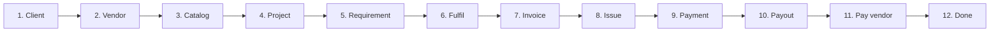

# Requirement Fulfilment Flow

End-to-end flow for **one requirement**: from client/vendor setup to vendor payout settlement.

---

## Billing by engagement and catalog type

How each combination of **engagement type** and **catalog type** is billed and what the requirement captures:

| Engagement   | Catalog type             | Billing scenario                                         | Requirement captures                                                                                       | Invoice line                                                                    |
| ------------ | ------------------------ | -------------------------------------------------------- | ---------------------------------------------------------------------------------------------------------- | ------------------------------------------------------------------------------- |
| **One-time** | Goods                    | Quantity × unit rate                                     | qty, rate (client_price = total or unit), optional period for delivery                                     | Description, Qty, Rate, Amount                                                  |
| **One-time** | Services (e.g. manpower) | Quantity × period × rate (e.g. n people × x days @ rate) | quantity (e.g. headcount), period_days (or period_description), rate per unit per period, amount = derived | Description e.g. "3 manpower for 10 days", Qty (e.g. 30 man-days), Rate, Amount |
| **One-time** | Consulting               | Same as services or fixed fee                            | quantity + period or single client_price                                                                   | As above or single line                                                         |
| **Monthly**  | Goods                    | Recurring supply (e.g. monthly qty × rate)               | quantity per month, rate, optional billing_cycle                                                           | Description, Qty, Rate, Amount (monthly)                                        |
| **Monthly**  | Services (e.g. manpower) | Salary / monthly retainer                                | monthly rate (client_price), billing_cycle = monthly; no qty/period                                         | Description "Monthly retainer — …", Qty 1, Rate = monthly amount, Amount        |
| **Monthly**  | Consulting               | Monthly retainer                                         | Same as monthly services                                                                                   | Same                                                                            |

**Simplified billing models:**

- **One-time – time & materials (T&M):** `quantity` (e.g. headcount), `period_days` (e.g. days), `unit_rate`. Amount = quantity × period_days × unit_rate (or quantity × unit_rate for goods).
- **One-time – fixed:** single `client_price` (total); optional free-text “period” for description only.
- **Monthly – retainer/salary:** `client_price` = amount per month; no quantity/period; invoice type = monthly; line = one row with description and amount.

**Requirement fields:** optional `quantity` (numeric), optional `period_days` (integer), optional `unit_rate`; `client_price` remains the total (or monthly amount for monthly projects). Invoice line items are built from these for print and Excel export.

---

## Step-by-step (high level)

| Step | Action | Where |
|------|--------|--------|
| 1 | Create **client** | Clients → Add client |
| 2 | Create **vendor(s)** | Vendors → Add vendor |
| 3 | Add **catalog items** (goods / services / consulting) | Catalog → Add item or Bulk add |
| 4 | (Optional) Link vendors to catalog items | Catalog → Open item → Vendors who can provide this |
| 5 | Create **project** (link to client) | Projects → New project |
| 6 | Add **requirement** (project + catalog item + vendor + client price + vendor cost) | Project → Requirements, or Requirements → Add requirement |
| 7 | Mark requirement **fulfilled** | Requirements → Open requirement → Fulfilment status → Fulfilled |
| 8 | Create **invoice** (project; amount can be suggested from requirements) | Finance → New invoice |
| 9 | **Issue** invoice (status → Issued; creates ledger entry) | Finance → Open invoice → Issue |
| 10 | Record **payment received** (against invoice) | Finance → Open invoice → Record payment |
| 11 | Create **vendor payout** (requirement + vendor + amount) | Finance → New vendor payout |
| 12 | Mark payout **paid** (set paid date; creates ledger entry) | Finance → Open payout → Mark paid |

---

## Flowchart (Mermaid)

```mermaid
flowchart TB
  subgraph setup["1. Setup"]
    A[Create Client] --> B[Create Vendor(s)]
    B --> C[Add Catalog Items<br/>goods / services / consulting]
    C --> D[Optional: Link vendors to catalog items]
  end

  subgraph project["2. Project & requirement"]
    E[Create Project<br/>link to client] --> F[Add Requirement<br/>project + catalog item + vendor<br/>client price + vendor cost]
    F --> G[Mark requirement Fulfilled]
  end

  subgraph client_money["3. Client billing & collection"]
    H[Create Invoice<br/>project, type, amount] --> I[Issue Invoice<br/>→ ledger: client_invoice]
    I --> J[Record Payment Received<br/>→ ledger: client_payment]
  end

  subgraph vendor_money["4. Vendor payout & settlement"]
    K[Create Vendor Payout<br/>requirement + vendor + amount] --> L{Paid date set?}
    L -->|Yes| M[→ ledger: vendor_payment]
    L -->|No| N[Payout status: Pending]
    N --> O[Mark Payout Paid<br/>set paid date]
    O --> M
  end

  setup --> project
  D --> E
  G --> H
  J --> K
  M --> done[End: requirement fulfilled,<br/>client paid, vendor settled]
```

---

## Flowchart (linear steps)



---

## Data flow summary

| Entity | Links to |
|--------|----------|
| **Client** | — |
| **Vendor** | — |
| **Catalog item** | Optional: catalog_vendor_availability (which vendors can supply it) |
| **Project** | client_id |
| **Requirement** | project_id, service_catalog_id, assigned_vendor_id, client_price, expected_vendor_cost; optional quantity, period_days, unit_rate for one-time T&M |
| **Invoice** | project_id; types: project / milestone / monthly |
| **Payment received** | invoice_id |
| **Vendor payout** | requirement_id, vendor_id; status pending/paid; paid_date |
| **Ledger entry** | project_id, type (client_invoice | client_payment | vendor_expected_cost | vendor_payment), reference_id |

Ledger is the single source of truth for money in/out per project; invoice issue and payment/payout actions create the corresponding ledger entries.
