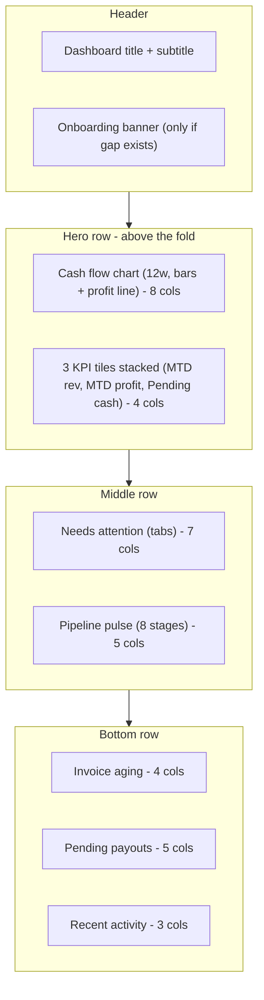
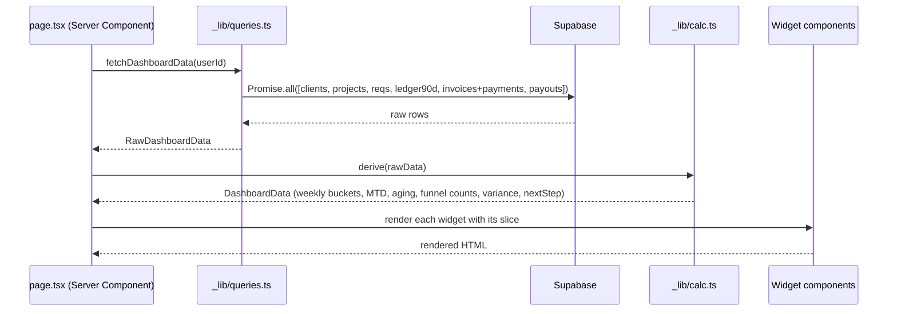

# Dashboard redesign — design spec

**Date:** 2026-04-17
**Status:** Approved direction, pending spec review
**Owner:** Dhaval
**Scope:** Rewrite `src/app/(dashboard)/page.tsx` as a command-center dashboard. Layout + visualizations + visual-system evolution. No schema changes.

## Problem

The current dashboard ([src/app/(dashboard)/page.tsx](../../../src/app/(dashboard)/page.tsx)) stacks seven sections vertically — Quick links, Get started / Next actions, Quick actions, Executive KPIs, Operations Pulse, Financial summary, Recent activity. It has significant content overlap (Quick links ≈ Quick actions ≈ Next actions; Executive KPIs ≈ Operations Pulse ≈ Financial summary), no trend visualization, and long vertical scroll before anything actionable appears. It reads like a link directory rather than a status cockpit.

## Goals

1. Single screen that answers "what's happening with my business right now and what needs my attention" in one scroll-free glance.
2. Combine three jobs the current version does separately: cash & profit health, outstanding-work triage, and pipeline pulse.
3. Introduce trend visualization without adding new tables — everything computed from existing `ledger_entries`, `invoices`, `payments_received`, `vendor_payouts`, `clients`, `projects`, `requirements`.
4. Evolve the visual system (glass-card, spacing, color semantics) toward a denser, more editorial cockpit feel.
5. Graceful empty/partial states so early-stage users still see the structure.

## Non-goals

- No schema changes, no new tables, no materialized views.
- No per-project deep-dive; that stays in Projects.
- No full analytics (cohorts, LTV, funnels); that stays in Reports.
- No dashboard customization / drag-drop / saved views.
- No real-time updates beyond Next.js's default server-render-per-nav.

## Design direction (approved)

**Cockpit Grid** — a 12-column grid that puts trend chart, KPIs, action queue, and pipeline pulse above the fold. Dense by design; the user explicitly accepted higher information density.

### High-level layout



### Widget contracts

Each widget below has: **purpose**, **data source**, **empty state**, and **interaction**. All data comes from server-rendered queries in the page component; no client-side fetching.

---

#### 1. Onboarding banner (conditional, top)

- **Purpose:** Surface the next setup step when the user has a gap in the Clients → Projects → Requirements chain.
- **Data:** Row counts of `clients`, `projects`, `requirements`.
- **Behavior:** Slim full-width banner with a single primary CTA ("Add your first client" / "Create a project" / "Add requirements"). Hidden once all three tables are non-empty. Never shown just because invoices/payouts are zero — those are expected at some point even in a healthy account.
- **Empty state:** The banner *is* the empty-state affordance; no nested empty treatment.

#### 2. Cash flow chart (hero, 8 cols)

- **Purpose:** Primary trend visualization. Answers "is money moving in the right direction".
- **Chart type:** Combo chart — grouped bars for money in (green) vs money out (red) per **ISO week**, last **13 weeks (≈90 days)**, with a **profit line** (money-in − money-out per bucket) overlaid on the same axis.
- **Data:** `ledger_entries` rows with `type in ('client_payment','vendor_payment')`, bucketed by `date_trunc('week', date)` over the last 91 days. All aggregation happens in the page's server component.
- **Legend row** (below chart): money-in swatch · money-out swatch · profit line swatch · **portfolio variance pill** (see §8).
- **Empty state:** Shows the axes and legend with a centered "No cash movement yet — record a payment or payout to see the trend" message.
- **Interaction:** None in v1 (no tooltips / zoom). Clicking the chart area links to `/ledger`.

#### 3. KPI tiles (hero, 4 cols, stacked 3-up)

Three tiles. Each tile: label (uppercase tracking-wide), value (tabular-nums, 24px), delta or context row (11px), optional sparkline (22px).

| Tile | Value | Delta / context | Sparkline |
|---|---|---|---|
| MTD revenue | Sum of `client_payment` in ledger this month | % vs same-day-of-month last month | Daily cumulative MTD revenue |
| MTD profit | `client_payment` − `vendor_payment` this month | % vs same-day-of-month last month | Daily cumulative MTD profit |
| Pending cash position | Net: pending collections − pending payouts | Two-part: "₹Xk to collect − ₹Yk to pay" | — (no sparkline; static callout) |

Delta rule: compare month-to-date through today's day-of-month vs same day-of-month in the previous month, not full last-month-vs-this-month (which would always look wrong mid-month). Positive delta = green arrow, negative = red, 0 = muted.

- **Empty state:** Value shows "—" and delta is hidden.

#### 4. Needs attention action queue (mid-left, 7 cols)

- **Purpose:** Consolidates the three current "Quick actions" / "Next actions" / "Quick links" sections into one triaged queue.
- **Tabs:** **Collect** (outstanding invoices) · **Pay** (pending vendor payouts) · **Fulfil** (open requirements). Tab label includes count badge. Default tab: whichever is non-empty, in order Collect → Pay → Fulfil.
- **Per-row layout:** primary line (e.g. "INV-2026-014 · Acme Labs"), secondary line (e.g. "Issued 28 Feb · overdue 18 days"), amount (right-aligned, color-coded by urgency), inline action link ("Record →" / "Pay →" / "Open →").
- **Sort:** Overdue first (by days overdue), then by amount desc. For Fulfil: by project due date nulls-last, then created_at asc.
- **Rows visible:** Top 5 per tab; "View all →" link goes to the relevant list page.
- **Data:**
  - Collect: `invoices` with `status in ('issued','overdue')`, net of `payments_received`, where net > 0.
  - Pay: `vendor_payouts` with `status='pending'`.
  - Fulfil: `requirements` with `fulfilment_status in ('pending','in_progress')`.
- **Urgency coloring:** amount text is red for overdue, amber for due within 7 days, default otherwise.
- **Empty state per tab:** centered text "Nothing to collect/pay/fulfil — clear." with a muted check icon.

#### 5. Pipeline pulse (mid-right, 5 cols)

- **Purpose:** Shows the 8-step flow from the sidebar as a horizontal-bar funnel so you can see where work is piled up.
- **Rows:** All 8 sidebar steps — Clients · Vendors · Projects · Requirements · Fulfilments · Invoicing · Settlement · Reports. (Reports shows "—" since it's a derived view, but stays in the list for visual consistency with the sidebar's numbered flow.)
- **Bar width:** normalized against the largest count.
- **Bottleneck highlight:** the stage with the highest count of *open/pending* items (Fulfilments = open reqs; Invoicing = unpaid invoices; Settlement = pending payouts) is flagged with an amber accent and a one-line tip below the funnel: "Bottleneck at Fulfilments — 5 open requirements awaiting vendor work."
- **Interaction:** Each row links to its corresponding list page.
- **Empty state:** Each row shows "0" without a bar; no bottleneck tip.

#### 6. Invoice aging (bottom-left, 4 cols)

- **Purpose:** Quantify how stale receivables are.
- **Viz:** Single horizontal stacked bar segmented by 0–30d / 31–60d / 60+ d, with the 60+ segment in red. Below the bar: three columns with bucket totals (amount and implied count).
- **Footer row:** "Oldest open: INV-2025-091 · Acme · 82 days · Nudge client →" — the oldest unpaid invoice, linking to its detail.
- **Data:** Same unpaid-invoice set as Action queue's Collect tab, bucketed by `issue_date` age.
- **Empty state:** "No outstanding invoices." centered, no bar.

#### 7. Pending payouts (bottom-middle, 5 cols)

- **Purpose:** Mirror of Action queue's Pay tab, but denormalized for always-visible context at the bottom so vendors aren't missed even when Collect/Fulfil tab is open above.
- **Rows:** Top 3 pending payouts, same per-row layout as the action queue.
- **Data:** `vendor_payouts` where `status='pending'`, sorted by due date asc nulls-last.
- **Empty state:** "All caught up on payouts." centered.

> **Note on apparent duplication with §4:** Pay is surfaced both in the tabbed queue (where it shares screen real estate with Collect/Fulfil) and in the always-visible bottom panel. This is deliberate — vendor payments carry real reputational cost and should never be hidden behind a tab.

#### 8. Portfolio variance pill (inside §2's legend)

- **Purpose:** Low-noise signal that planned vs actual profit is drifting across the portfolio.
- **Computation:** Σ(planned_profit) − Σ(actual_profit) across all active projects, shown as a percentage of planned. Planned = `client_price − expected_vendor_cost`; actual = `client_received − vendor_paid` (all derived, no stored totals — per project rules).
- **Display:** `Portfolio variance +2.4% →`. Clicks through to `/reports`. Green if actual ≥ planned, red if below.
- **Empty state:** hide the pill entirely if there are no active projects.

#### 9. Recent activity (bottom-right, 3 cols)

- **Purpose:** Ambient awareness of what's been happening.
- **Rows:** Last 4 ledger entries with a colored dot (green = client payment, red = vendor payment, blue = other). Primary line: entry type. Secondary: project name + relative time. Amount right-aligned, signed.
- **Data:** `ledger_entries` ordered by `date desc, created_at desc limit 4`.
- **Footer link:** "Log →" to `/activity`.
- **Empty state:** "No activity yet." with muted tone.

---

### Visual system evolution

Keep the existing dark-first palette and `glass-card` foundation but tighten it for density. All tokens already declared in [src/app/globals.css](../../../src/app/globals.css).

**Retained tokens:**
`--background: 222 47% 6%` · `--card: 222 47% 8%` · `--muted: 217 33% 17%` · `--border: 217 33% 17%` · `--ring: 263 70% 50%` (primary violet).

**Dashboard-specific additions** (scoped CSS, page-level only — do not pollute globals):

- Introduce three semantic money colors used in the KPI deltas, action queue amounts, chart bars, and activity dots:
  - `--positive: 152 68% 52%` (emerald)
  - `--negative: 350 89% 65%` (rose)
  - `--warn: 38 92% 58%` (amber, for soon-due / bottleneck highlights)
- Introduce a compact KPI tile style: border, 14px radius, 14–16px internal padding, label/value/delta vertical rhythm of 4px/4px/6px. This is lighter than the current `glass-card` 20px padding and larger 2xl radius.
- The chart, aging bar, and funnel bars share a single primary violet (`--ring`) accent with varying opacity to keep visual noise down; semantic money colors are reserved for the actual in/out/profit signals.
- Typography: tabular-nums on every money / count value. `letter-spacing: -0.02em` on KPI values. Labels use `text-[11px] uppercase tracking-[0.06em] font-semibold text-muted-foreground`.

**What changes visually vs today:**
- Radius comes down slightly on the new tile (rounded-xl instead of 2xl) to differentiate primary KPIs from larger glass cards.
- Glass blur stays only on the outer panels; KPI tiles are flatter for legibility.
- More consistent inter-panel gap (14px grid gap) than today's mixed 3/4/6/8 spacing.

### Responsive behavior

- **≥1280px (desktop, default):** the 12-col grid above.
- **1024–1279px:** hero row stays as 8/4; middle row stacks to 12/12; bottom row becomes 6/6 + 12 (activity drops below).
- **<1024px (tablet):** everything collapses to a single column in widget priority order: banner → chart → 3 KPIs → action queue → pipeline pulse → payouts → aging → activity.
- **<640px (phone):** same single column, KPIs become a 2-col grid (first two) + full-width third; chart height reduces from 240px to 180px. Mobile is a secondary surface — usable, not optimized.

### Empty state strategy

Approved approach: **ghost widgets + slim onboarding banner**. The full layout is always rendered. Each widget shows its own empty message (content defined per-widget above). The onboarding banner only appears when the Clients → Projects → Requirements chain has a gap; once all three tables are non-empty, the banner disappears permanently.

### Loading behavior

- Dashboard is a Server Component doing a single `Promise.all` fan-out of its queries, same pattern as today. No skeleton on initial load (fast enough).
- A `loading.tsx` sibling returns a minimal skeleton mirroring the final grid structure (9 rounded panels with pulsing backgrounds) for route transitions.
- Each widget's own data errors render as a discreet per-widget error state ("Couldn't load this panel — Retry"), not a full-page error — so one failed query doesn't blank the dashboard.

## Architecture / file structure

The current 380-line [page.tsx](../../../src/app/(dashboard)/page.tsx) mixes data fetching, calculation, and rendering. That's fine today but will not scale to 9 widgets. Break it apart along widget boundaries.

```
src/app/(dashboard)/
  page.tsx                          # thin orchestrator: fetch, hand data to widgets
  loading.tsx                       # skeleton grid
  dashboard/                        # NEW folder, dashboard-only components
    _lib/
      queries.ts                    # all dashboard SQL; returns typed DTOs
      calc.ts                       # pure functions: MTD aggregates, aging buckets,
                                    # weekly buckets, variance, next-step detection
      types.ts                      # DashboardData, WidgetData DTOs
    onboarding-banner.tsx
    cash-flow-chart.tsx             # uses Recharts or hand-rolled SVG (see below)
    kpi-tile.tsx                    # shared KPI tile primitive
    kpi-strip.tsx                   # composes 3 tiles with the page's trio
    action-queue.tsx                # tabbed (collect/pay/fulfil)
    pipeline-pulse.tsx
    invoice-aging.tsx
    pending-payouts.tsx
    recent-activity.tsx
    variance-pill.tsx
```

Rules per project cursorrules:
- `page.tsx` stays thin — parse auth, call `queries.ts`, pass DTOs to widgets.
- `queries.ts` = repository layer (Supabase calls only).
- `calc.ts` = service layer (pure functions, unit-testable — derive aggregates, buckets, variance).
- Each widget file is a Server Component receiving already-derived data as typed props. No widget does its own SQL.

### Charting library decision

Two viable paths:

- **Hand-rolled SVG** (approach used in the mockup). Zero dependency, ~80 lines for the cash-flow chart, total control over visuals. Good fit because the chart is simple (grouped bars + line) and won't need interactivity in v1.
- **Recharts** (`recharts` already would be a new dep). Saves code, but adds ~90KB gz and the chart is so simple that the lib is overkill.

**Recommendation: hand-rolled SVG.** Consistent with the codebase's current zero-chart-lib footprint, keeps bundle size flat, and matches v1 requirement of "no interactivity". Revisit if tooltips / zoom / multiple chart types are needed later.

## Data flow



## Testing

- Unit tests for `_lib/calc.ts` — pure functions, high value: weekly bucketing, MTD aggregation, aging buckets (edge cases: same-day, DST, partial week), variance calc, next-step detection.
- No component tests for widgets in v1 — they're Server Components with straightforward JSX.
- Manual smoke with seed data: empty DB, partial (only clients), full dataset.

## Rollout

Single commit replacing the current `page.tsx`. No feature flag — this is a visual-only change with same route, same auth, same data contracts. Old file structure goes away; no long-lived dual path.

## Out of scope for this spec (explicit YAGNI)

- Drag-drop widget rearrangement.
- Customizable time ranges on the chart (always 13w).
- Per-widget CSV export.
- Alerts / push notifications for bottlenecks.
- Planned-vs-actual per-project breakdown on the dashboard (lives in Reports).
- Mobile-optimized layout tuning beyond the responsive stacking described.
- Dark/light mode toggle UX (the `.light` tokens exist but no UI to switch).

## Open questions

None at this spec — all framing questions answered during brainstorming.

## References

- Current dashboard: [src/app/(dashboard)/page.tsx](../../../src/app/(dashboard)/page.tsx)
- Sidebar (defines 8-step flow): [src/components/layout/sidebar.tsx](../../../src/components/layout/sidebar.tsx)
- Design tokens: [src/app/globals.css](../../../src/app/globals.css)
- Project conventions: [.cursorrules](../../../.cursorrules)
- Visual mockup: `.superpowers/brainstorm/dashboard-preview.html` (local, git-ignored)
